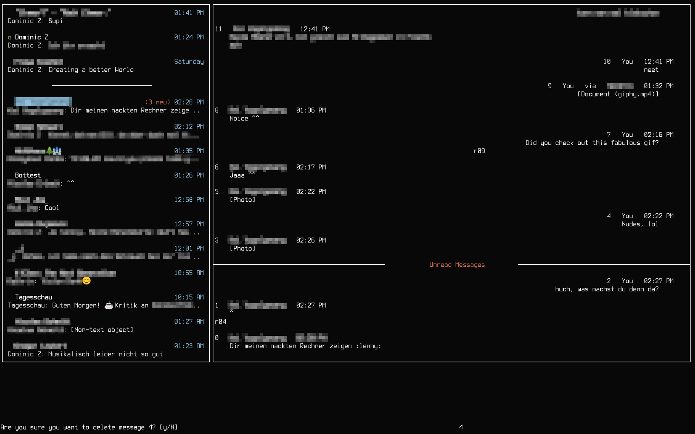

# TTTC, the telegram client

TTTC is an unofficial [Telegram](https://telegram.org/) commandline client.
It aims to provide a user experience similar to that of [VIM](https://www.vim.org/).

## Keybindings
Currently, there is no way of changing the keybindings in a config. This is subject to change in a future update.

The default key bindings are

Key | Function
--|--
i| Enter insert mode (to compose a message)
Y, Return | Send message
Esc | Cancel, Exit current mode
c/C | Previous/Next Dialog
E | Toggle emoji ASCII display
`n` e | Edit message `n` (ESC to open prompt to save changes)
`n` r | Reply to message `n` (submit draft)
`n` d | Delete message `n`
`n` y | Yank/copy message `n`
`n` l | Download media of message `n`
`n` L | (Re)Download media of message `n` (force)
`n` m | Open downloaded file of message `n` with `xdg-open`
`n` o | Open link(s) in message `n`. Use TAB to select between multiple links
`n` f | Adds message `n` to the list of messages to be forwarded. Press return to select chat, return again to forward to selected chat
P | (Un)Pin the currently selected chat
UP/DOWN | Scroll up/down in the history of the currently selected dialog
/ | enter search mode
n/N | Previous/Next search result
Q | exit TTTC
q `r` | Record macro into register `r`

## Requirements
TTTC uses the `curses`, `pyperclip` and `telethon` python libraries. Curses is usually shipped with
your python installation. You can install the required libraries with `pip install -r requirements.txt`.

In order to use TTTC, you will need your own Telegram `api_id` and `api_hash`.
You can read more about how to get them [here](https://core.telegram.org/api/obtaining_api_id).

Once you obtained your own api key and hash, you need to set them as your environment variables
`TTTC_API_ID` and `TTTC_API_HASH`, respectively.

The client can be run with `python3 tttc.py`.
